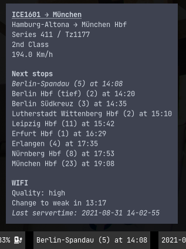

# waybar-iceportal

A simple [waybar] module to display the status of the ICE you are currently in using the ICE Portals JSON API.



## Installation

0. Ensure python[^pyver] is installed: `python3 --version`
1. Clone the git repository to a location of your choosing: `git clone https://github.com/e1mo/waybar-iceportal.git`
2. Install the python dependencies: `pip install -r requirements.txt`
3. Add the snipped below to your waybar configuration (usually `~/.config/waybar/config`)
4. Reload your waybar (either restart your WM such as sway or just run `waybar`)

```json
    "modules-right": [
      // Your other modules
      "custom/iceportal-wifi"
    ]
    // Simply append at the bottom
    "custom/iceportal-wifi": {
        "interval": 15,
        "return-type": "json",
        "exec": "path/to/waybar-iceportal/waybar-iceportal",
        "tooltip": true,
    },
```

For further information on custom waybar modules, refer to the [waybar wiki on custom modules][waybarWiki].

## Developing / testing

The script has a couple of parameters to help with developing / debugging outside of ICEs or on those with broken WiFi. They can be shown using `--help`. As of writing this, the output looks like this:

```bash
$ ./waybar-iceportal --help
usage: waybar-iceportal [-h] [--dummy-data DUMMY_DATA] [--dump [DUMP]]

Waybar module for the ICE Portal (Train Info, Stops, WIFI Status). Nothing will be displayed if the
iceportal is not reachable (e.G. you are not in an ICE or the WIFI is down)

optional arguments:
  -h, --help            show this help message and exit
  --dummy-data DUMMY_DATA
                        Folder to load dummy data from. {status,trip}.json must be present.
  --dump [DUMP]         Dump trip / status json to a subfolder within the specified folder. If no value
                        is specified, will create a folder 'data-dump' besides the script.
```

Using the `--dummy-data` option, previously saved data (e.g. from --dump) will be used instead of fetching new data.
For convenience, there is a dump included in this repository under `data/2021-08-31-12-02-55-ice1601`.

To aid with debugging (since I unfortunately don't have a BC100 :/ ) you can dump the data by passing `--dump`.
Either a option can be specified, otherwise the data will be written to a timestamped folder, located in the `data-dump` located next to the script, so it will look like this: `data-dump/2021-08-31-22-24-35`.

## Outlook

Whats next? Well, I don't know. Overall it's done I think, but some minor improovments could be made.

- Display the WiFi status directly in the waybar
  - Either by passing a class to change the background color using styles
  - Or using emojis, but there are no reception unicocdes
- Add different output modes
  - Simple text output for debugging
  - i3blocks style output
- Maybe even porting this to be a gnome extension? (But I don't think this is going to happen)

[waybar]: https://github.com/alexays/waybar/
[waybarWiki]: https://github.com/Alexays/Waybar/wiki/Module:-Custom
[^pyver]: I have only tested this script in Python 3.9, but it should work on older versions.
